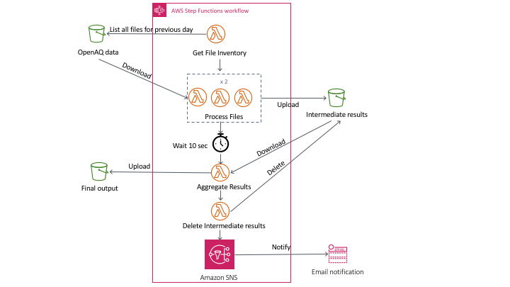

# Serverless Reference Architecture: Extract Transfer Load

This reference architecture demonstrates the use of [AWS Step Functions](https://aws.amazon.com/step-functions/) to orchestrate an Extract Transfer Load (ETL) workflow with [AWS Lambda](https://aws.amazon.com/lambda/).

This solution processes the global air quality data, [OpenAQ](https://registry.opendata.aws/openaq/) available in the AWS registry for open data. It generates the minimum, maximum and average ratings for air quality measurements on a daily basis. The ETL workflow will have to be triggered manually but this can be easily scheduled on a recurring basis using [Amazon EventBridge rule](https://docs.aws.amazon.com/eventbridge/latest/userguide/scheduled-events.html). Once the transformation completes, you will be notified over email of the S3 location to the summarized data.

## Architecture



## Application Components

The architecture uses AWS Step Functions to orchestrate the extract, transfer and load phases of the data pipeline. All states are backed by Lambda functions.

### Extract Phase

The first step is a [Task](https://docs.aws.amazon.com/step-functions/latest/dg/amazon-states-language-task-state.html) state. This function lists the contents of the OpenAQ S3 bucket (openaq-fetches) for the previous day and groups the files into six sets of 24 files each. There are six files generated for every hour of the day. So, we are grouping 4 hours' worth data in each set. Although all files are not identical in size, this results in an approximately even distribution of data in each set. A list of these six groups of files is passed to the next step in the state machine.

You can change the number of files to be grouped in each set by updating the `ChunkSize` parameter in the SAM template. Increasing the number of files in each set will increase the processing time in the transform phase.

### Transform Phase

The second step is a [Map](https://docs.aws.amazon.com/step-functions/latest/dg/amazon-states-language-map-state.html) state. The Map state allows executing the same sequence of transformations for each element of the input array. There are six elements in this case corresponding to the six sets of files from the extract phase. Since the default concurrency has been set to three, the input array elements are processed three at a time. This can be changed by updating the `MapConcurrency` parameter in the SAM template.

Increasing concurrency will allow processing the files faster. Setting the concurrency to six will process all files in parallel. In scenarios where processing involves downstream dependencies, capping the concurrency can protect the downstream systems from being overwhelmed.

The key transformations in the state involve using the Python `Pandas` library to flatten the raw JSON data, extract relevant columns and deduplicate the data. The output of this state is a list of S3 locations to the six intermediate files generated by each of the six Map task executions. The files are written to S3 because the data exceeds the maximum limit for Step Functions result data size.

### Load Phase

The third step is a [Task](https://docs.aws.amazon.com/step-functions/latest/dg/amazon-states-language-task-state.html) state. This downloads the files generated by the transform phase, combines them and calculates the summary statistics.

This step uses the Python `Pandas` and `Numpy` libraries to resample the hourly timeseries data and calculate daily minimum, maximum and average values of air quality ratings. The data is summarized by location, city and country. This is written as a gzipped CSV file to S3.

### Cleanup Phase

A [Task](https://docs.aws.amazon.com/step-functions/latest/dg/amazon-states-language-task-state.html) deletes the S3 files created by the transform phase. This step is invoked regardless of whether the load phase succeeds or not.

### Notification

The final state of the workflow uses the Step Functions native integration with S3 to send an email notification of the final status. On successful execution of the workflow, the notification will include the path to the final output file in S3. In case of errors with any of the states above, the notification will include the name of the state that failed and details of the error message.

## Running the Example

You can use the provided AWS SAM template to launch a stack that demonstrates the Lambda ETL reference architecture. You will need the latest version of AWS SAM CLI installed. You can follow instructions [here](https://docs.aws.amazon.com/serverless-application-model/latest/developerguide/serverless-sam-cli-install.html). You also need Docker installed and running.

### Using SAM to Build and Deploy the Application

#### Build

The AWS SAM CLI comes with abstractions for a number of Lambda runtimes to build your dependencies, and copies the source code into staging folders so that everything is ready to be packaged and deployed. The sam build command builds any dependencies that your application has, and copies your application source code to folders under `.aws-sam/build` to be zipped and uploaded to Lambda.

```shell
sam build --use-container
```

#### Package

Next, run sam package. This command takes your Lambda handler source code and any third-party dependencies, zips everything, and uploads the zip file to your Amazon S3 bucket. That bucket and file location are then noted in the packaged-template.yaml file. You use the generated packaged-template.yaml file to deploy the application in the next step.

```shell
sam package \
    --region region \
    --output-template-file packaged-template.yaml \
    --s3-bucket bucketname \
    --s3-prefix lambda-etl-refarch
```

> Note
> Substitute region with your AWS region. For bucketname in this command, you need an Amazon S3 bucket that the sam package command can use to store the deployment package. The deployment package is used when you deploy your application in a later step. If you need to create a bucket for this purpose, run the following command to create an Amazon S3 bucket:

```shell
aws s3 mb s3://bucketname --region region  # Use the same region you are deploying to
```

#### Deploy

This command deploys your application to the AWS Cloud. It's important that this command explicitly includes both of the following:

- The AWS Region to deploy to. This Region must match the Region of the Amazon S3 source bucket.
- The CAPABILITY_IAM parameter, because creating new Lambda functions involves creating new IAM roles.

You need to substitute bucketname in the command below with an existing Amazon S3 bucket. This is used to store intermediate results as well as the final output of processing. You can use the same bucket you used for `Package` step.

```shell
sam deploy \
    --template-file packaged-template.yaml \
    --stack-name lambda-etl-refarch \
    --region region \
    --tags Project=lambda-refarch-etl \
    --parameter-overrides TargetBucketName=bucketname NotificationEmailAddress=<your email address> \
    --capabilities CAPABILITY_IAM
```

You will receive an email asking you to confirm subscription to the NotificationTopic SNS topic that will receive status of workflow execution.

## Testing the Example

Once you have deployed the SAM template, you can directly trigger the Step Function ETLOrchestrator-* from the console. You can alternately trigger an execution using the commands below. Don't forget to substitute your region.

```shell
STEP_ARN=$(aws cloudformation describe-stacks --region region --stack-name lambda-etl-refarch --query 'Stacks[0].Outputs[?OutputKey==`ETLOrchestrator`].OutputValue' --output text)

aws stepfunctions start-execution --region region --state-machine-arn $STEP_ARN
```

Once the execution completes, you will get an email notification with the S3 path to the final summarized data file. You can download this locally to examine the contents.

```shell
aws s3 cp <link to the S3 url from notification> .
```

## Cleaning Up the Example Resources

To remove all resources created by this example, do the following:

### Cleanup S3 Bucket

If you created a new bucket for this example, you can use the command below.

```shell
aws s3 rm s3://bucketname --recursive
```

If you specified an existing bucket, all artefacts are created under the prefix `lambda-etl-refarch`. You can delete this using the command below.

```shell
aws s3 rm s3://bucketname/lambda-etl-refarch --recursive
```

### Delete the CloudFormation Stack

```shell
aws cloudformation delete-stack \
    --region region \
    --stack-name lambda-etl-refarch
```

### Delete the CloudWatch Log Groups

```shell
for log_group in $(aws logs describe-log-groups --log-group-name-prefix '/aws/lambda/lambda-etl-refarch-' --query "logGroups[*].logGroupName" --output text); do
  echo "Removing log group ${log_group}..."
  aws logs delete-log-group --log-group-name ${log_group}
  echo
done

aws logs delete-log-group --log-group-name ETLOrchestrator
```

## Well architected framework

Please refer to the [well architected review](well-architected.md) document for details.

## LICENSE

This reference architecture sample is licensed under Apache 2.0.
